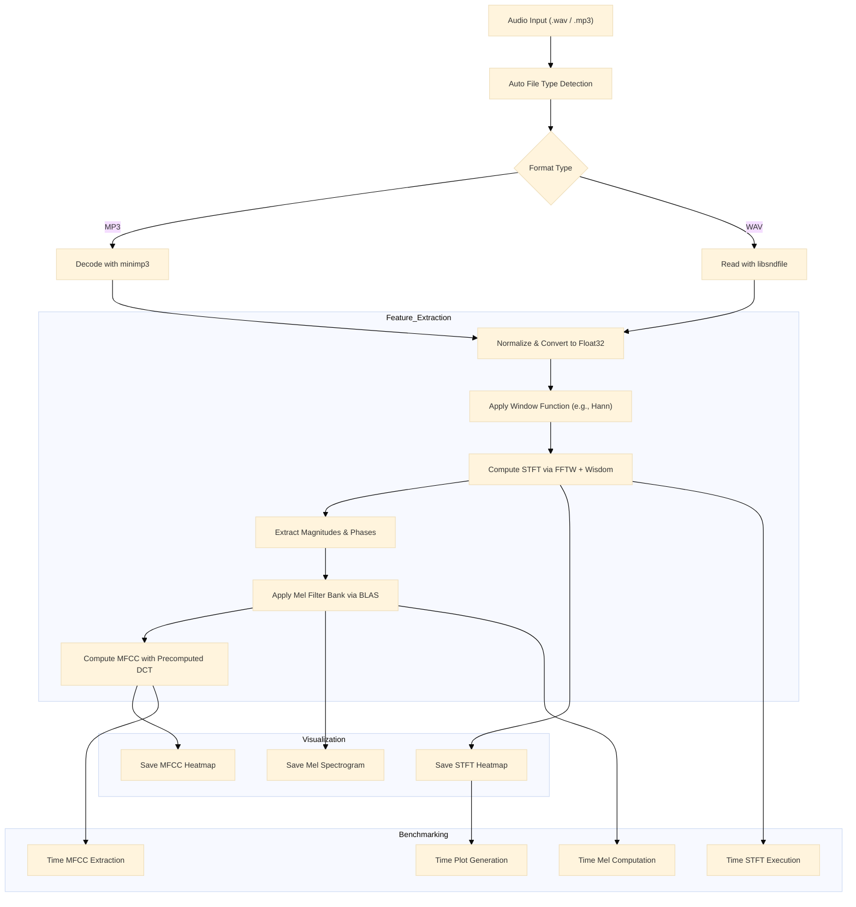

# c_spectrogram: High-Performance Audio Signal Processing and Visualization

**c_spectrogram** is a high-performance C library for audio signal processing and visualization, featuring Short-Time Fourier Transform (STFT), Mel spectrograms, Mel-Frequency Cepstral Coefficients (MFCC), and professional-grade heatmap visualizations. Optimized for large-scale audio datasets, it leverages [FFTW](http://www.fftw.org/) with wisdom caching, [OpenMP](https://www.openmp.org/) parallelization, and BLAS ([OpenBLAS](https://www.openblas.net/)) for fast matrix operations. The library supports multiple audio formats (WAV, FLAC, MP3) via [libsndfile](https://libsndfile.github.io/libsndfile/) and [minimp3](https://github.com/lieff/minimp3), and offers customizable visualizations with extensive color schemes.

## Key Features

- **Audio I/O**:
  - Supports WAV, FLAC, and MP3 formats with automatic file type detection.
  - Powered by [libsndfile](https://libsndfile.github.io/libsndfile/) for WAV/FLAC and [minimp3](https://github.com/lieff/minimp3) for MP3 decoding.

- **Short-Time Fourier Transform (STFT)**:
  - Computes STFT using FFTW with wisdom caching for optimized FFT planning.
  - Supports multiple window functions: Hann, Hamming, Blackman, Bartlett, Blackman-Harris, Flat-top, Gaussian, Kaiser.
  - Configurable parameters: window size, hop size, and frequency bounds.

- **Mel Spectrogram**:
  - Generates Mel spectrograms with dynamically computed Mel filter banks.
  - Accelerated with BLAS (`cblas_sdot`) and OpenMP for multi-core scalability.
  - Optional dB scaling with branchless computation for efficiency.

- **Mel-Frequency Cepstral Coefficients (MFCC)**:
  - Computes MFCCs using precomputed DCT coefficients and BLAS-accelerated operations.
  - Parallelized with OpenMP for high performance.
  - Visualizes MFCCs as heatmaps with customizable color schemes.

- **Visualization**:
  - Renders STFT, Mel spectrograms, and MFCCs as PNG heatmaps using [libheatmap](https://github.com/lucasb-eyer/libheatmap).
  - Supports extensive color schemes (e.g., Blues, Viridis, Jet, Inferno) in discrete, mixed, mixed_exp, and soft variants.
  - Configurable time and frequency bounds for focused visualizations.
  - Cache-friendly memory operations for efficient rendering.

- **Benchmarking**:
  - Microsecond-precision profiling for STFT, Mel spectrogram, MFCC, and visualization.
  - Ranked timing reports with color-coded visualizations and runtime percentages.
  - Outputs in JSON and raw formats for integration with analysis tools.

- **Performance Optimizations**:
  - OpenMP parallelization for STFT, Mel spectrogram, MFCC, and visualization.
  - FFTW wisdom caching for reusable, optimized FFT plans.
  - BLAS integration for efficient linear algebra in Mel and MFCC computations.
  - Compiler optimizations: `-ffast-math`, `-march=native`, `-funroll-loops`, Link-Time Optimization (LTO).
  - Aligned memory allocations for cache efficiency.

- **Applications**:
  - Bioacoustics (e.g., bird call analysis with `black_woodpecker.wav`, `bird.mp3`).
  - Large-scale audio processing, feature extraction for machine learning, and DSP research.

## Pipeline Overview

The following diagram illustrates the audio processing and visualization pipeline:



## Performance Highlights

- **MP3 Decoding & PNG Saving**: Shockingly fast — faster than Librosa, faster than anything in Python. minimp3 and libpng just show up, do their job, and leave. If the whole pipeline moved like this, we’d be done before the coffee brewed.

- **STFT & Mel Spectrogram**: Still slower than Librosa — even with FFTW wisdom caching and OpenMP. Not sure why. Librosa somehow still beats it. The Mel spectrogram part was especially disappointing: I tried to make it fast with BLAS, but the output came out wrong. Only one loop could be vectorized — the other two just sat there, immune to optimization. The filter bank creation is clean, but the actual dot-product part still suffers under that cursed 2-level nested loop ( I could eliminate 1 loop via BALS though, kinda win ig).

- **Scalability**: OpenMP does help  not so much , very much unsable until you compare the core DSP to librosa

## Requirements

- **Compiler**: GCC or Clang with C11 support.
- **Dependencies**:
  - **FFTW3** ([FFTW](http://www.fftw.org/)) for fast Fourier transforms.
  - **libsndfile** ([libsndfile](https://libsndfile.github.io/libsndfile/)) for WAV/FLAC file handling.
  - **OpenMP** ([OpenMP](https://www.openmp.org/)) for parallel processing.
  - **BLAS** (e.g., [OpenBLAS](https://www.openblas.net/)) for matrix operations.
  - **libpng** ([libpng](http://www.libpng.org/pub/png/libpng.html)) for PNG output.
  - **Optional**: [OpenCV](https://opencv.org/) for additional color schemes (`opencv_like` build).
- **Hardware**: Modern CPU recommended for optimal performance.

## Installation

### Step 1: Install Dependencies
For Ubuntu/Debian:
```bash
sudo apt-get update
sudo apt-get install libfftw3-dev libsndfile1-dev libopenblas-dev libpng-dev libomp-dev
```
For OpenCV-like color schemes (optional):
```bash
sudo apt-get install libopencv-dev
```

### Step 2: Clone the Repository
```bash
git clone https://github.com/8g6-new/c_spectrogram
cd c_spectrogram
```

### Step 3: Build the Project
Choose a build target:
- **Built-in color schemes**:
  ```bash
  make builtin
  ```
- **OpenCV-like color schemes**:
  ```bash
  make opencv_like
  ```
- **Shared library**:
  ```bash
  make shared
  ```
- **Debug builds**:
  ```bash
  make debug_builtin
  make debug_opencv_like
  ```

The build creates executables in `build/builtin` or `build/opencv` and generates FFTW wisdom files in `cache/FFT` (e.g., `1024.wisdom`).

### Step 4: Verify Build
Ensure the executable (`builtin` or `opencv_like`) and wisdom files are created:
```bash
ls build/builtin
ls cache/FFT
```

## Usage

### Command-Line Interface
Run the `main` program to process an audio file and generate STFT, Mel spectrogram, and MFCC visualizations:
```bash
./build/builtin/main <input_file> <output_prefix> <window_size> <hop_size> <window_type> <num_mel_banks> <min_mel> <max_mel> <num_mfcc_coeffs> <cs_stft> <cs_mel> <cs_mfcc> <cache_folder>
```

**Parameters**:
- `input_file`: Path to audio file (e.g., `tests/files/black_woodpecker.wav`).
- `output_prefix`: Prefix for output PNG files (e.g., `outputs/black_woodpecker`).
- `window_size`: STFT window size (e.g., 2048).
- `hop_size`: Hop size for STFT (e.g., 512).
- `window_type`: Window function (e.g., `hann`, `hamming`, `blackman`).
- `num_mel_banks`: Number of Mel filters (e.g., 40).
- `min_mel`, `max_mel`: Frequency range for Mel filters (e.g., 20.0, 8000.0).
- `num_mfcc_coeffs`: Number of MFCC coefficients (e.g., 13).
- `cs_stft`, `cs_mel`, `cs_mfcc`: Color scheme indices (e.g., 0 for default, see `output/colors.json`).
- `cache_folder`: Directory for FFTW wisdom files (e.g., `cache/FFT`).

**Example**:
```bash
./build/builtin/main tests/files/black_woodpecker.wav outputs/black_woodpecker 2048 512 hann 40 20.0 8000.0 13 0 0 0 cache/FFT
```

**Output**:
- PNG files: `outputs/black_woodpecker_stft.png`, `outputs/black_woodpecker_mel.png`, `outputs/black_woodpecker_mfcc.png`.
- Console output: Audio metadata (duration, sample rate) and ranked benchmark timings.

### Programmatic Usage
Below is a simplified example of using the library in C:

```c
#include "headers/audio_tools/audio_io.h"
#include "headers/audio_tools/spectral_features.h"
#include "headers/audio_tools/audio_visualizer.h"
#include "headers/utils/bench.h"

int main() {
    benchmark_init(); // Initialize benchmarking

    // Load audio
    audio_data audio = auto_detect("tests/files/black_woodpecker.wav");
    print_ad(&audio);

    // Compute STFT
    size_t window_size = 2048, hop_size = 512;
    float *window_values = malloc(window_size * sizeof(float));
    window_function(window_values, window_size, "hann");
    fft_d fft = init_fftw_plan(window_size, "cache/FFT");
    stft_d result = stft(&audio, window_size, hop_size, window_values, &fft);

    // Compute Mel filter bank
    size_t num_filters = 40;
    float *mel_filter_bank = calloc((result.num_frequencies + 1) * (num_filters + 2), sizeof(float));
    melbank_t melbank = mel_filter(20.0f, 8000.0f, num_filters, audio.sample_rate, window_size, mel_filter_bank);

    // Compute MFCC
    size_t num_coeffs = 13;
    mffc_t dft_coeffs = precompute_cosine_coeffs(num_filters, num_coeffs);

    // Set visualization bounds
    bounds2d_t bounds = { .freq = {20.0f, 8000.0f} };
    init_bounds(&bounds, &result);
    set_limits(&bounds, result.num_frequencies, result.output_size);

    // Copy STFT magnitudes
    float *contiguous_mem = malloc((bounds.freq.end_d - bounds.freq.start_d) * (bounds.time.end_d - bounds.time.start_d) * sizeof(float));
    fast_copy(contiguous_mem, result.magnitudes, &bounds, result.num_frequencies);

    // Visualize STFT spectrogram
    plot_t settings = { .db = true, .cs_enum = CS_Blues, .output_file = "outputs/stft.png" };
    settings.bg_color[0] = 0; settings.bg_color[1] = 0; settings.bg_color[2] = 0; settings.bg_color[3] = 255;
    spectrogram(contiguous_mem, &bounds, &settings);

    // Compute and visualize Mel spectrogram
    settings.output_file = "outputs/mel.png";
    float *mel_values = mel_spectrogram(contiguous_mem, num_filters, result.num_frequencies, mel_filter_bank, &bounds, &settings);

    // Compute and visualize MFCC
    settings.output_file = "outputs/mfcc.png";
    mfcc(mel_values, &dft_coeffs, &bounds, &settings);

    // Print benchmark results
    print_bench_ranked();

    // Cleanup
    free(mel_values);
    free(mel_filter_bank);
    free(contiguous_mem);
    free(window_values);
    free_stft(&result);
    free_fft(&fft);
    free_audio(&audio);
    free(dft_coeffs.coeffs);
    free(melbank.freq_indexs);
    free(melbank.weights);
    return 0;
}
```
## Sample Visualizations

Below are sample visualizations generated from `black_woodpecker.wav`, showcasing STFT spectrograms, Mel spectrograms, and MFCC heatmaps with various color schemes. These examples use the `builtin` and `opencv_like` builds.

### STFT Spectrograms (Built-in Color Schemes)
- **Blues (Soft)**: Smooth gradient for clear frequency visualization.
  
- **Spectral (Discrete)**: High-contrast for distinct frequency bands.
  

### STFT Spectrograms (OpenCV-like Color Schemes)
- **Viridis**: Popular for scientific visualization, emphasizing frequency dynamics.
  
- **Jet**: Classic colormap for highlighting intensity variations.
  

### Mel Spectrogram and MFCC
- **Mel Spectrogram (Cividis)**: Visualizes Mel filter bank output.
  
- **MFCC (Blues Soft)**: Displays cepstral coefficients for feature extraction.
  

To explore all available color schemes (e.g., Blues, Viridis, Jet, Inferno in discrete, mixed, mixed_exp, and soft variants), refer to the `README.MD` files in:
- [`outputs/colorschemes/libheatmap_defaults/README.MD`](./outputs/colorschemes/libheatmap_defaults/README.MD) for built-in color schemes.
- [`outputs/colorschemes/opencv_like/README.MD`](./outputs/colorschemes/opencv_like/README.MD) for OpenCV-like color schemes.

These files include comprehensive galleries of all color schemes applied to `black_woodpecker.wav`.

## 🎨 Colormap Enum Reference
All supported colormaps are listed in the file:

```bash
output/colors.json
```
This file maps human-readable names to internal enum IDs for both:

OpenCV-like colormaps (e.g., JET, VIRIDIS, HOT)

Built-in scientific colormaps (e.g., Blues.soft, Spectral.mixed_exp)

Refer [`outputs/README.MD`](./outputs/README.MD)


## Output Directory Structure
The `outputs` directory contains:
- `colorschemes/libheatmap_defaults`:
  - `discrete`: High-contrast colormaps (e.g., `black_woodpecker_stft_Blues_discrete.png`).
  - `mixed`: Smooth color transitions (e.g., `black_woodpecker_stft_Blues_mixed.png`).
  - `mixed_exp`: Exponentially scaled colors (e.g., `black_woodpecker_stft_Blues_mixed_exp.png`).
  - `soft`: Softened gradients (e.g., `black_woodpecker_stft_Blues_soft.png`).
- `colorschemes/opencv_like/images`: OpenCV-inspired colormaps (e.g., `black_woodpecker_stft_Viridis.png`).
- `functions`: Mel spectrograms and MFCC heatmaps (e.g., `black_woodpecker_mel.png`, `black_woodpecker_mfcc.png`).

## Benchmarking Output
The `print_bench_ranked` function generates a ranked table of execution times:
- Columns: Function name, execution time (µs, ms, or s), percentage of total runtime.
- Visual: Color-coded bars for quick bottleneck identification.

**Example**:
```
### 🔍 Sample Benchmark Output

```text
Running builtin...
Input Filename       : ./tests/files/173.mp3
Output Filename      : bird
Window Size          : 2048
Hop Size             : 128
Window Type          : hann
Number of Filters    : 128
Min Mel Frequency    : 0.00
Max Mel Frequency    : 7500.00
Number of Coeffs     : 64
Cache STFT Channels  : 2
Cache Mel Channels   : 3
Cache MFCC Channels  : 4
Cache Folder         : ./cache/FFT
./tests/files/173.mp3 auto detected to be audio/mpeg
duration:58.032
channels:1
num_samples:2785536
sample_rate:48000.0000
file_size_bytes:784356
Cache not found or import failed. Creating FFT plan...
Error saving wisdom to file: ./cache/FFT/2048.wisdom
enum 2 => libheatmap builtin color scheme : main type PRGn , subtype mixed
stft ended
Time bounds:
  Start (f): 0.00
  End   (f): 0.00
  Start (d): 0
  End   (d): 21747
Frequency bounds:
  Start (f): 0.00
  End   (f): 7500.00
  Start (d): 0
  End   (d): 320

copy ended

bird_stft.png saved
bird_mel.png saved
bird_mfcc.png saved
---------------------------------------------------------
| Function             | Exec Time    | % of total runtime |
---------------------------------------------------------
| stft_plot            |      7.206 s | 49.4490% |
[▰▰▰▰▰▰▰▰▰           ]
| mel                  |      3.518 s | 24.1430% |
[▰▰▰▰                ]
| mfcc                 |      2.283 s | 15.6638% |
[▰▰▰                 ]
| stft                 |   925.131 ms | 6.3480% |
[▰                   ]
| dec_mp3              |   482.269 ms | 3.3092% |
[                    ]
| fetch fft cache 1    |   129.612 ms | 0.8894% |
[                    ]
| copy                 |    27.156 ms | 0.1863% |
[                    ]
| file_read            |      658 µs | 0.0045% |
[                    ]
| dtft coff            |      391 µs | 0.0027% |
[                    ]
| mel filter bank      |      390 µs | 0.0027% |
[                    ]
| stft window          |      146 µs | 0.0010% |
[                    ]
| auto_det             |       65 µs | 0.0004% |
[                    ]
---------------------------------------------------------
```

bechmarked in colab

## Build Configuration

The `Makefile` provides optimized build targets:
- **Compiler Flags**:
  - `-ffast-math`, `-march=native`, `-mtune=native`: CPU-specific optimizations.
  - `-funroll-loops`, `-floop-interchange`, `-floop-unroll-and-jam`: Loop optimizations.
  - `-flto`, `-fuse-linker-plugin`: Link-Time Optimization.
  - `-mavx`, `-msse4.2`: Implicit SIMD support via compiler flags (no explicit SIMD code).
  - `-ftree-vectorize`, `-ftree-loop-vectorize`: Automatic vectorization.
- **Debug Flags**:
  - `-Og`, `-g`, `-fno-omit-frame-pointer`: Debugging support.
  - `-fsanitize=address`, `-fsanitize=leak`, `-fsanitize=undefined`: Memory and behavior checks.
- **Build Targets**:
  - `make builtin`: Built-in color schemes.
  - `make opencv_like`: OpenCV-like color schemes.
  - `make shared`: Shared library (`libyourlib.so`).
  - `make debug_builtin`, `make debug_opencv_like`: Debug builds.
  - `make clean`: Remove build artifacts.

## Project Structure

```
.
├── cache/FFT/              # FFTW wisdom files for optimized FFT plans
├── headers/                # Header files for audio tools, heatmap, and utilities
├── outputs/                # Generated spectrograms, Mel spectrograms, and MFCC heatmaps
├── src/                    # Source code for audio processing, visualization, and utilities
│   ├── libheatmap/         # Heatmap visualization code
│   ├── png_tools/          # PNG output utilities
│   ├── utils/              # Benchmarking and utility functions
│   ├── audio_tools/        # Audio I/O, STFT, Mel, and MFCC computation
├── tests/files/            # Test audio files (e.g., black_woodpecker.wav, bird.mp3)
├── main.c                  # Main program for testing the pipeline
├── Makefile                # Build configuration
└── README.md               # This file
```

## Performance Optimization Tips

- **Multi-threading**: Set `OMP_NUM_THREADS` to match CPU cores (e.g., `export OMP_NUM_THREADS=8`).
- **BLAS**: Use optimized BLAS (e.g., [OpenBLAS](https://www.openblas.net/)) for faster Mel and MFCC computations.
- **Wisdom Caching**: Pre-generate FFTW wisdom files for common window sizes.
- **Matrix Operations**: Replace `cblas_sdot` with `cblas_sgemm` for batched matrix multiplications in `mel_spectrogram` and `mfcc`.
- **Fast Math**: Test `-ffast-math` for numerical stability, as it may introduce inaccuracies.
- **GPU**: Pipeline is GPU-ready for STFT ([cuFFT](https://developer.nvidia.com/cufft)), Mel spectrograms ([cuBLAS](https://developer.nvidia.com/cublas)), and visualization (CUDA kernels).

## Future Work

- **Explicit SIMD Support**: Implement explicit SIMD optimizations (e.g., SSE, SSE2, AVX, AVX2) for STFT, Mel spectrogram, and MFCC computations, beyond current implicit support via `minimp3` and compiler flags.
- **GPU Acceleration**: Implement CUDA-based STFT ([cuFFT](https://developer.nvidia.com/cufft)), Mel spectrograms ([cuBLAS](https://developer.nvidia.com/cublas)), and visualization for Librosa-like performance.
- **Sparse Matrix Operations**: Use CSR format for Mel filter banks to reduce memory and computation.
- **Real-Time Processing**: Support streaming audio analysis.
- **Enhanced Benchmarking**: Add memory usage and CPU/GPU utilization metrics to `bench.h`.
- **Simple Heatmap**: Replace `heatmap_add_weighted_point()` in `libheatmap` with a custom heatmap generator for faster rendering.
- **Memory Pooling**: Implement memory pooling using a memory arena to improve utilization and prevent issues like use-after-free.
- **Advanced Memory Management**: Integrate buddy allocators or other techniques to optimize memory allocation and reduce fragmentation.
- **Documentation**: Add detailed API docs and usage examples to `headers/` and `README.md`.

## 📄 License

- **Code**: Licensed under the [MIT License](./LICENSE).  
  You are free to use, modify, and distribute the code, including for commercial purposes, with proper attribution.

Credit this work if used in research or applications.

## Acknowledgments

- Inspired by [Librosa](https://librosa.org/) for high-performance audio processing in C.
- Tested on bioacoustics datasets (e.g., bird calls), with thanks to [FFTW](http://www.fftw.org/) and [libsndfile](https://libsndfile.github.io/libsndfile/).
- Gratitude to [OpenBLAS](https://www.openblas.net/), [libpng](http://www.libpng.org/pub/png/libpng.html), and [OpenMP](https://www.openmp.org/).
- Thanks to [lucasb-eyer/libheatmap](https://github.com/lucasb-eyer/libheatmap) for the heatmap visualization module.
- Credit to [lieff/minimp3](https://github.com/lieff/minimp3) for lightweight MP3 decoding.
