# 🎧 CARA (C Acoustic Representation & Analysis): High-Performance Audio Signal Processing and Visualization Pipeline

**CARA** is a high-performance C library for audio signal processing and visualization, featuring Short-Time Fourier Transform (STFT), generalized filter bank spectrograms (e.g., Mel, Bark, ERB), Feature Cepstral Coefficients (FCC), and professional-grade heatmap visualizations. Optimized for large-scale audio datasets, it leverages [FFTW](http://www.fftw.org/) with wisdom caching, [OpenMP](https://www.openmp.org/) parallelization, and BLAS ([OpenBLAS](https://www.openblas.net/)) for fast matrix operations. The library supports multiple audio formats (WAV, FLAC, MP3) via [libsndfile](https://libsndfile.github.io/libsndfile/) and [minimp3](https://github.com/lieff/minimp3), and offers customizable visualizations with extensive color schemes.

## ✨ Key Features

- 🎧 **Audio I/O**: Reads WAV, AAC, MP3, etc., with auto-detection. [minimp3](https://github.com/lieff/minimp3) decodes MP3s efficiently; other formats use [libsndfile](https://libsndfile.github.io/libsndfile/).
- 📊 **Short-Time Fourier Transform (STFT)**: Uses FFTW with wisdom caching and microsecond-precision benchmarking. Supports Hann, Hamming, Blackman, Bartlett, Blackman-Harris, Flattop, Gaussian, and Kaiser windows. Customizable window size, hop size, and frequency bounds.
- 🔊 **Generalized Filter Bank Spectrograms**: Supports multiple frequency scales (Mel, Bark, ERB, Chirp, Cam, Log10, Cent) with dynamic filter bank generation. Accelerated with BLAS (`cblas_sdot`) and OpenMP. Optional dB scaling with branchless computation for efficiency.
- 🧠 **Feature Cepstral Coefficients (FCC)**: Computes FCCs (formerly MFCCs) using precomputed DCT coefficients and BLAS. OpenMP parallelization ensures scalability. Returns coefficient arrays for flexible downstream use.
- 🖼️ **Visualization**: Outputs STFT, filter bank spectrograms, and FCCs as PNG heatmaps using [libheatmap](https://github.com/lucasb-eyer/libheatmap). Supports 🎨 **130 Colormap Variants**:
  - 🎨 22 OpenCV-style colormaps
  - 🌈 108 scientific colormaps (27 base × 4 variants: discrete, soft, mixed, mixed_exp)
- ⏱️ **Benchmarking**: Microsecond-precision profiling for STFT, filter bank, FCC, and visualization. Ranked timing reports with color-coded bars identify bottlenecks. Outputs JSON and raw data for analysis.
- ⚙️ **Performance Optimizations**: OpenMP parallelism, FFTW wisdom caching, BLAS matrix operations, and compiler flags (`-ffast-math`, `-march=native`, `-funroll-loops`, LTO). Aligned memory allocation enhances cache locality.
- 🐦 **Applications**: Ideal for bioacoustics (e.g., bird calls: `tests/files/black_woodpecker.wav`, `tests/files/173.mp3`), large-scale audio processing, ML feature extraction, and DSP research.

## 💡 Motivation

The main motivation behind CARA is to provide a clear, educational, and high-performance C implementation of audio signal processing, focusing on transparency and minimal dependencies. While libraries like [Librosa](https://librosa.org/) and [rust-mfcc](https://github.com/bytesnake/mfcc) offer excellent performance, they often abstract away the DSP pipeline, making it hard for learners to understand the underlying mechanics. CARA addresses this by:

1. **Readability**: Clean, well-structured code that beginners in C can follow.
2. **Educational Value**: A step-by-step DSP pipeline with explicit implementations of STFT, filter banks, and FCCs.
3. **Transparency**: Detailed computations for windowing, FFT, filter bank construction, and DCT.
4. **Flexibility**: Support for multiple frequency scales (Mel, Bark, ERB, etc.) for diverse audio analysis tasks.

CARA helped me understand:
- The interplay of **windowing**, **hop size**, and **FFT resolution**.
- **Filter bank construction** for various frequency scales.
- **FCC computation** using DCT and its role in audio analysis.
- The impact of **memory layout**, **cache locality**, and **aligned memory** on performance.
- Optimization techniques like **BLAS vectorization**, **OpenMP parallelization**, and **loop restructuring**.

While not yet matching Librosa's performance, CARA is a hackable reference for students, hobbyists, and DSP enthusiasts aiming to build audio processing pipelines from scratch.

## Pipeline Overview

The updated pipeline reflects the enhanced abstraction and flexibility of the new implementation:

```mermaid
%%{init: {
  "theme": "base",
  "themeVariables": {
    "primaryColor": "#1e1e1e",
    "primaryTextColor": "#ffffff",
    "primaryBorderColor": "#ffaa00",
    "clusterBkg": "#2a2a2a",
    "clusterBorder": "#ffaa00",
    "lineColor": "#ffaa00",
    "fontSize": "14px",
    "fontFamily": "monospace"
  }
}}%%

flowchart TD
    %% Input and Decoding
    A["📥 Audio Input (.wav / .mp3)"] --> B["🔍 Auto File Type Detection"]
    B --> C{"🧩 Format Type"}
    C -->|MP3| D["🎧 Decode with minimp3"]
    C -->|Other| E["🎵 Read with libsndfile"]
    D --> F["🎚️ Normalize → Float32"]
    E --> F

    %% Feature Extraction
    subgraph Feature Extraction
        F --> G["🪟 Apply Window Function"]
        G --> H["⚡ STFT (FFTW + Wisdom)"]
        H --> I["📊 Extract Magnitudes & Phases"]
        I --> J["🎚️ Apply Filter Bank (Mel, Bark, ERB, etc.)"]
        J --> K["🎯 Compute FCC (DCT)"]
    end

    %% Visualization
    subgraph Visualization
        I --> V1["🖼️ STFT Heatmap"]
        J --> V2["🎨 Filter Bank Spectrogram"]
        K --> V3["🌡️ FCC Heatmap"]
    end

    %% Benchmarking
    subgraph Benchmarking
        H --> B1["⏱️ Time STFT"]
        J --> B2["⏱️ Time Filter Bank"]
        K --> B3["⏱️ Time FCC"]
        V1 --> B4["⏱️ Time Plot Generation"]
    end
```



## Performance Highlights

- **MP3 Decoding & PNG Saving**: Competitive with Python, thanks to efficient [minimp3](https://github.com/lieff/minimp3) and [libpng](http://www.libpng.org/pub/png/libpng.html).
- **STFT**: Improved with FFTW wisdom caching and OpenMP, but still trails Librosa. New microsecond-precision benchmarking in `main.c` helps identify bottlenecks.
- **Filter Bank Spectrograms**: Generalized to support Mel, Bark, ERB, Chirp, Cam, Log10, and Cent scales, using BLAS (`cblas_sdot`) and OpenMP. Performance is decent but limited by nested loops; only one loop is vectorized. Future `cblas_sgemm` use could improve this.
- **FCC**: Modularized computation returns coefficient arrays, optimized with BLAS and OpenMP. Visualization is decoupled, improving flexibility but requiring separate plotting calls.
- **Scalability**: OpenMP parallelization scales well on multi-core systems, though Librosa remains faster for unknown reasons.

## Requirements

- **Compiler**: GCC or Clang with C11 support.
- **Dependencies**:
  - **FFTW3** ([FFTW](http://www.fftw.org/)) for fast Fourier transforms.
  - **libsndfile** ([libsndfile](https://libsndfile.github.io/libsndfile/)) for WAV/FLAC file handling.
  - **OpenMP** ([OpenMP](https://www.openmp.org/)) for parallel processing.
  - **BLAS** (e.g., [OpenBLAS](https://www.openblas.net/)) for matrix operations.
  - **libpng** ([libpng](http://www.libpng.org/pub/png/libpng.html)) for PNG output.

## Installation

### Step 1: Install Dependencies
For Ubuntu/Debian:
```bash
sudo apt-get update
sudo apt-get install libfftw3-dev libsndfile1-dev libopenblas-dev libpng-dev libomp-dev
```

### Step 2: Clone the Repository
```bash
git clone https://github.com/8g6-new/CARA && cd CARA
```

### Step 3: Build the Project
Choose a build target:
- **Built-in color schemes**:
  ```bash
  make builtin
  ```
- **OpenCV-like color schemes**:
  ```bash
  make opencv_like
  ```

The build creates executables in `build/builtin` or `build/opencv` and generates FFTW wisdom files in `cache/FFT` (e.g., `1024.wisdom`).

## Usage

### Command-Line Interface
Run the `main` program to process an audio file and generate STFT, filter bank spectrogram, and FCC visualizations:
```bash
./build/builtin/main <input_file> <output_prefix> <window_size> <hop_size> <window_type> <num_filters> <min_freq> <max_freq> <num_coff> <cs_stft> <cs_mel> <cs_mfcc> <cache_folder>
```

**Parameters**:
- `input_file`: Path to audio file (e.g., `tests/files/black_woodpecker.wav`).
- `output_prefix`: Prefix for output PNG files (e.g., `outputs/black_woodpecker`).
- `window_size`: STFT window size (e.g., 2048).
- `hop_size`: Hop size for STFT (e.g., 512).
- `window_type`: Window function (e.g., `hann`, `hamming`, `blackman`, `bartlett`, `blackman-harris`, `flattop`, `gaussian`, `kaiser`).
- `num_filters`: Number of filter banks (e.g., 40).
- `min_freq`, `max_freq`: Frequency range for filter banks (e.g., 20.0, 8000.0).
- `num_coff`: Number of FCC coefficients (e.g., 13).
- `cs_stft`, `cs_mel`, `cs_mfcc`: Color scheme indices (e.g., 0 for default, see `output/colors.json`).
- `cache_folder`: Directory for FFTW wisdom files (e.g., `cache/FFT`).

**Example**:
```bash
./build/builtin/main tests/files/black_woodpecker.wav outputs/black_woodpecker 2048 512 hann 40 20.0 8000.0 13 0 0 0 cache/FFT
```

**Output**:
- PNG files: `outputs/black_woodpecker_stft.png`, `outputs/black_woodpecker_mel.png`, `outputs/black_woodpecker_mfcc.png`.
- Console output: Audio metadata (duration, sample rate), bounds information, and ranked benchmark timings.

### Programmatic Usage
Below is an updated example reflecting the new `main.c` and upgraded functions:

```c
#include "headers/audio_tools/audio_io.h"
#include "headers/audio_tools/spectral_features.h"
#include "headers/audio_tools/audio_visualizer.h"
#include "headers/utils/bench.h"

int main() {
    benchmark_init(); // Initialize benchmarking

    // Load audio
    audio_data audio = auto_detect("tests/files/black_woodpecker.wav");
    print_ad(&audio);

    // Compute STFT
    size_t window_size = 2048, hop_size = 512;
    float *window_values = malloc(window_size * sizeof(float));
    window_function(window_values, window_size, "hann");
    fft_d fft = init_fftw_plan(window_size, "cache/FFT");
    stft_d result = stft(&audio, window_size, hop_size, window_values, &fft);

    // Compute filter bank (Mel)
    size_t num_filters = 40;
    float *filterbank = calloc((result.num_frequencies + 1) * (num_filters + 2), sizeof(float));
    filter_bank_t bank = gen_filterbank(F_MEL, 20.0f, 8000.0f, num_filters, audio.sample_rate, window_size, filterbank);

    // Compute FCC
    size_t num_coff = 13;
    dct_t dft_coff = gen_cosine_coeffs(num_filters, num_coff);

    // Set visualization bounds
    bounds2d_t bounds = { .freq = {20.0f, 8000.0f} };
    init_bounds(&bounds, &result);
    set_limits(&bounds, result.num_frequencies, result.output_size);

    // Copy STFT magnitudes
    float *cont_mem = malloc((bounds.freq.end_d - bounds.freq.start_d) * (bounds.time.end_d - bounds.time.start_d) * sizeof(float));
    copy_data(cont_mem, result.magnitudes, &bounds, result.num_frequencies);

    // Visualize STFT spectrogram
    plot_t settings = { .db = true, .cs_enum = CS_Blues, .output_file = "outputs/stft.png", .w = bounds.time.end_d - bounds.time.start_d, .h = bounds.freq.end_d - bounds.freq.start_d };
    settings.bg_color[0] = 0; settings.bg_color[1] = 0; settings.bg_color[2] = 0; settings.bg_color[3] = 255;
    plot(cont_mem, &bounds, &settings);

    // Compute and visualize filter bank spectrogram
    settings.output_file = "outputs/mel.png";
    settings.h = num_filters;
    float *mel_values = apply_filter_bank(cont_mem, num_filters, result.num_frequencies, filterbank, &bounds, &settings);
    plot(mel_values, &bounds, &settings);

    // Compute and visualize FCC
    settings.output_file = "outputs/mfcc.png";
    settings.h = num_coff;
    float *fcc_values = FCC(mel_values, &dft_coff, &bounds, &settings);
    plot(fcc_values, &bounds, &settings);

    // Print benchmark results
    print_bench_ranked();

    // Cleanup
    free(mel_values);
    free(fcc_values);
    free(filterbank);
    free(cont_mem);
    free(window_values);
    free_stft(&result);
    free_fft_plan(&fft);
    free_audio(&audio);
    free(dft_coff.coeffs);
    free(bank.freq_indexs);
    free(bank.weights);
    return 0;
}
```

## 📊 Full Function Visualizations

Below are visualizations produced by the pipeline for a single audio input (`black_woodpecker.wav`), using various color schemes and stages of the DSP pipeline: STFT, Filter Bank Spectrogram, and FCC.

---

### 🎛️ Function Outputs

Visualizations generated using a 2048-point FFT, 128-sample hop size, and **Cividis** colormap.

| Output Type         | Description                                      | Preview |
|---------------------|--------------------------------------------------|---------|
| **STFT Spectrogram**| Raw Short-Time Fourier Transform magnitudes      |  |
| **Filter Bank Spectrogram** | Filter bank output (256 filters, Mel scale) |  |
| **FCC**            | 128-dimensional Feature Cepstral Coefficients   |  |

### 🐢 STFT Spectrograms (Built-in Color Schemes)

| Colormap        | Style      | Preview |
|------------------|------------|---------|
| **Blues**        | Soft       |  |
| **Spectral**     | Discrete   |  |

---

### 🎨 STFT Spectrograms (OpenCV-like Color Schemes)
*Colormaps generated via custom script using OpenCV reference gradients:*  
[`ref/opencv_like/colormap_gen.py`](https://github.com/8g6-new/CARA/blob/main/ref/opencv_like/colormap_gen.py)

| Colormap        | Description                                       | Preview |
|------------------|---------------------------------------------------|---------|
| **Rainbow**      | A bright and cheerful spectrum of colors. |  |
| **Jet**          | High-contrast legacy colormap                    |  |

To explore all available color schemes (e.g., Blues, Viridis, Jet, Inferno in discrete, mixed, mixed_exp, and soft variants), refer to the `README.MD` files in:
- [`outputs/colorschemes/libheatmap_defaults/README.MD`](./outputs/colorschemes/libheatmap_defaults/README.MD) for built-in color schemes.
- [`outputs/colorschemes/opencv_like/README.MD`](./outputs/colorschemes/opencv_like/README.MD) for OpenCV-like color schemes.

## 🎨 Colormap Enum Reference
All supported colormaps are listed in the file:
```bash
output/colors.json
```
This file maps human-readable names to internal enum IDs for both:
- OpenCV-like colormaps (e.g., JET, VIRIDIS, HOT)
- Built-in scientific colormaps (e.g., Blues.soft, Spectral.mixed_exp)

Refer to [`outputs/README.MD`](./outputs/README.MD) for details.

## Output Directory Structure
The `outputs` directory contains:
- `colorschemes/libheatmap_defaults`:
  - `discrete`: High-contrast colormaps (e.g., `black_woodpecker_stft_Blues_discrete.png`).
  - `mixed`: Smooth color transitions (e.g., `black_woodpecker_stft_Blues_mixed.png`).
  - `mixed_exp`: Exponentially scaled colors (e.g., `black_woodpecker_stft_Blues_mixed_exp.png`).
  - `soft`: Softened gradients (e.g., `black_woodpecker_stft_Blues_soft.png`).
- `colorschemes/opencv_like/images`: OpenCV-inspired colormaps (e.g., `black_woodpecker_stft_Viridis.png`).
- `functions`: Filter bank spectrograms and FCC heatmaps (e.g., `black_woodpecker_mel.png`, `black_woodpecker_mfcc.png`).

## Benchmarking Output
The `print_bench_ranked` function generates a ranked table of execution times:
- Columns: Function name, execution time (µs, ms, or s), percentage of total runtime.
- Visual: Color-coded bars for quick bottleneck identification.

**Example**:
For the command:
```bash
./build/opencv_like ./tests/files/black_woodpecker.wav bird 2048 128 hann 256 0 7500 128 16 16 16 ./cache/FFT
```
Or simply:
```bash
make run
```
**Output**: Visualizations with Cividis (opencv_like, color 16) or BuPu-discrete (builtin, color 16) colormaps, plus benchmark timings:


*Note*: Filter bank computation is slower due to `heatmap_add_weighted_point` calls in `libheatmap`. Separating computation and visualization (as done in the new `apply_filter_bank` and `FCC`) improves modularity but doesn’t yet address this bottleneck. Benchmarked on AMD Ryzen 5 4600H CPU.

## Project Structure

```
.
├── cache/FFT/              # FFTW wisdom files for optimized FFT plans
├── headers/                # Header files for audio tools, heatmap, and utilities
├── outputs/                # Generated spectrograms, filter bank spectrograms, and FCC heatmaps
├── src/                    # Source code for audio processing, visualization, and utilities
│   ├── libheatmap/         # Heatmap visualization code
│   ├── png_tools/          # PNG output utilities
│   ├── utils/              # Benchmarking and utility functions
│   ├── audio_tools/        # Audio I/O, STFT, filter bank, and FCC computation
├── tests/files/            # Test audio files (e.g., black_woodpecker.wav, bird.mp3)
├── main.c                  # Main program for testing the pipeline
├── Makefile                # Build configuration
└── README.md               # This file
```

## Performance Optimization Tips

- **BLAS**: Use optimized BLAS (e.g., [OpenBLAS](https://www.openblas.net/)) for faster filter bank and FCC computations. Consider `cblas_sgemm` for batched operations in `apply_filter_bank` and `FCC`.
- **Wisdom Caching**: Pre-generate FFTW wisdom files for common window sizes.
- **SIMD**: Leverage explicit SSE, SSE2, or AVX instructions for STFT and filter bank loops, beyond current compiler optimizations.
- **GPU**: Pipeline is GPU-ready for STFT ([cuFFT](https://developer.nvidia.com/cufft)), filter banks ([cuBLAS](https://developer.nvidia.com/cublas)), and visualization (CUDA kernels).
- **Fast Math**: Test `-ffast-math` carefully, as it may introduce numerical inaccuracies in filter bank calculations.

## Future Work

- **Explicit SIMD Support**: Implement SSE, SSE2, AVX, or AVX2 for STFT, filter bank, and FCC computations.
- **GPU Acceleration**: Use [cuFFT](https://developer.nvidia.com/cufft) and [cuBLAS](https://developer.nvidia.com/cublas) for Librosa-like performance.
- **Sparse Matrix Operations**: Apply CSR format for filter banks to reduce memory and computation.
- **Real-Time Processing**: Support streaming audio analysis.
- **Enhanced Benchmarking**: Add memory usage and CPU/GPU utilization metrics to `bench.h`.
- **Custom Heatmap**: Replace `heatmap_add_weighted_point` in `libheatmap` with a faster custom renderer.
- **Memory Pooling**: Implement a memory arena to optimize allocation and prevent use-after-free issues.
- **Advanced Memory Management**: Use buddy allocators to reduce fragmentation.
- **Documentation**: Expand API docs and usage examples in `headers/` and `README.md`.

## 📄 License

- **Code**: Licensed under the [MIT License](./LICENSE).  
  You are free to use, modify, and distribute the code, including for commercial purposes, with proper attribution.

Credit this work if used in research or applications.

## Acknowledgments

- Inspired by [Librosa](https://librosa.org/) for high-performance audio processing in C.
- Tested on bioacoustics datasets (e.g., bird calls), with thanks to [FFTW](http://www.fftw.org/) and [libsndfile](https://libsndfile.github.io/libsndfile/).
- Gratitude to [OpenBLAS](https://www.openblas.net/), [libpng](http://www.libpng.org/pub/png/libpng.html), and [OpenMP](https://www.openmp.org/).
- Thanks to [lucasb-eyer/libheatmap](https://github.com/lucasb-eyer/libheatmap) for the heatmap visualization module.
- Credit to [lieff/minimp3](https://github.com/lieff/minimp3) for lightweight MP3 decoding.