# OpenCV-like Color Schemes

These color schemes are inspired by the predefined color gradients available in OpenCV documentation. The gradients were carefully extracted from various images provided by OpenCV and converted into RGB format using OpenCV's `cvtColor` function. Each gradient was processed into RGBA values and organized into a format suitable for integration into different applications.

By following OpenCV's well-established color palettes, these schemes offer a familiar and consistent experience for users accustomed to the library's color representations. The color gradients represent a range of hues and transitions, ideal for visualizing data across different domains while maintaining the color characteristics defined by OpenCV.

## Color Scheme Descriptions

| Enum ID | Color Scheme | Description |
|--------:|------------------------|-------------|
| 0 | AUTUMN | A warm and vibrant color scheme, progressing from reds and oranges to yellows, evoking feelings of coziness and nostalgia. |
| 1 | BONE | A soft, off-white color with subtle gray undertones, reminiscent of natural materials, often used for a neutral and calming effect. |
| 2 | JET | A deep, rich black color with a slight sheen, often associated with elegance and sophistication, resembling the gemstone jet. |
| 3 | WINTER | A cool and crisp color palette featuring icy blues, whites, and grays, reflecting the serene beauty of a winter landscape. |
| 4 | RAINBOW | A bright and cheerful spectrum of colors, representing diversity and joy, often used to symbolize hope and inclusivity. |
| 5 | OCEAN | A soothing blend of blues and greens, reminiscent of the sea, evoking feelings of tranquility and freshness. |
| 6 | SUMMER | A vibrant and lively color scheme filled with bright yellows, greens, and blues, capturing the essence of sunny days and outdoor fun. |
| 7 | SPRING | A fresh and pastel palette featuring soft pinks, greens, and yellows, symbolizing renewal, growth, and the blooming of flowers. |
| 8 | COOL | A palette of calming blues, greens, and purples, creating a serene and refreshing atmosphere, often associated with relaxation. |
| 9 | HSV | A color model based on Hue, Saturation, and Value, allowing for a wide range of colors to be represented in a visually intuitive way. |
| 10 | PINK | A soft and warm color, often associated with love and compassion, ranging from pale blush to vibrant fuchsia. |
| 11 | HOT | A bold and intense color scheme featuring bright reds, oranges, and yellows, evoking feelings of energy and passion. |
| 12 | PARULA | A soothing blend of blue and green hues, reminiscent of tropical waters and lush landscapes, often used in nature-inspired designs. |
| 13 | MAGMA | A fiery and dynamic color palette featuring deep reds, oranges, and blacks, representing the intense heat and energy of molten rock. |
| 14 | INFERNO | A dramatic and intense color scheme with fiery reds, oranges, and yellows, evoking the power and heat of flames. |
| 15 | PLASMA | A vibrant and energetic palette featuring bright purples, blues, and pinks, reminiscent of the glowing colors of plasma in physics. |
| 16 | VIRIDIS | A color scheme characterized by bright greens and blues, often used in data visualization to represent growth and vitality. |
| 17 | CIVIDIS | A color palette that transitions from teal to blue, providing a modern and fresh look, often used in visualizations and design. |
| 18 | TWILIGHT | A soft and muted color scheme featuring deep blues, purples, and hints of pink, capturing the serene beauty of dusk. |
| 19 | TWILIGHT_SHIFTED | A variation of the twilight palette with adjusted hues, creating a unique and dreamy atmosphere, perfect for artistic expressions. |
| 20 | TURBO | A bright and energetic color scheme featuring vivid colors, often used to convey speed and excitement in design. |
| 21 | DEEP_GREEN | A rich and dark green color, reminiscent of lush forests and nature, evoking feelings of stability and growth. |

## Examples (In Enum Order)

| Enum ID | Name | Spectrogram |
|--------:|------|-------------|
| 0 | AUTUMN | 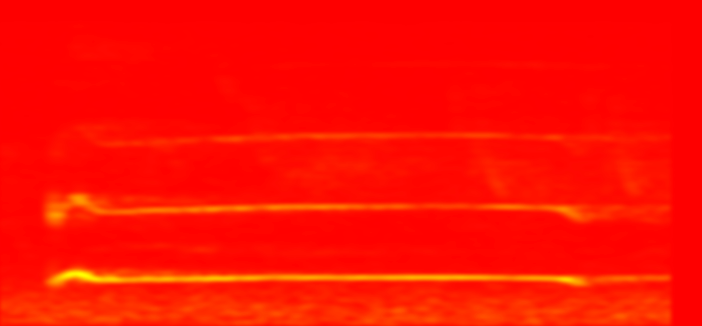 |
| 1 | BONE |  |
| 2 | JET |  |
| 3 | WINTER | 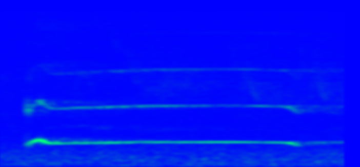 |
| 4 | RAINBOW |  |
| 5 | OCEAN | 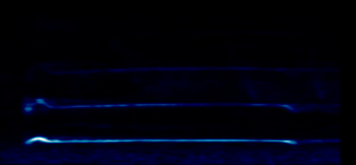 |
| 6 | SUMMER |  |
| 7 | SPRING | 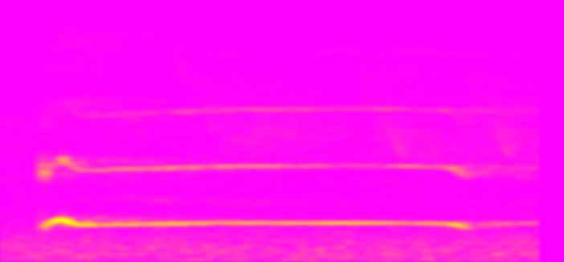 |
| 8 | COOL |  |
| 9 | HSV | 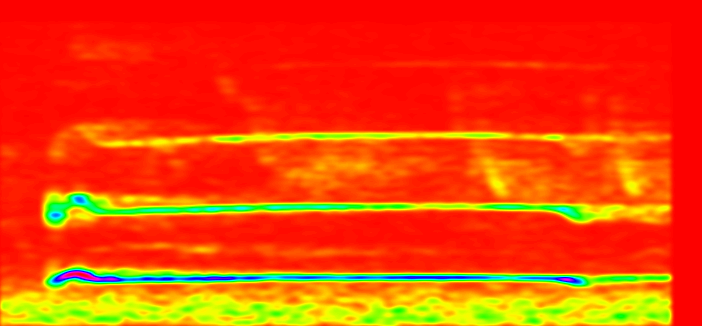 |
| 10 | PINK | 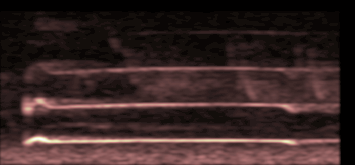 |
| 11 | HOT | 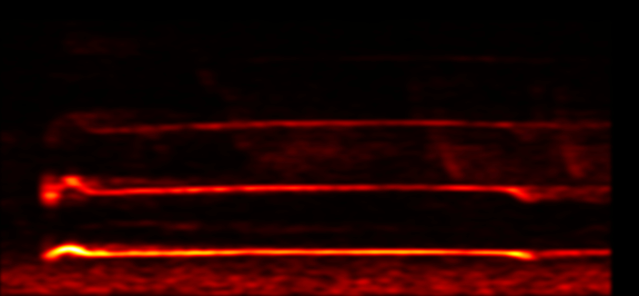 |
| 12 | PARULA | 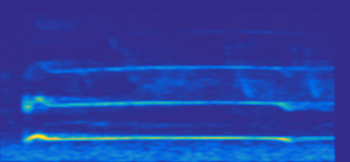 |
| 13 | MAGMA | 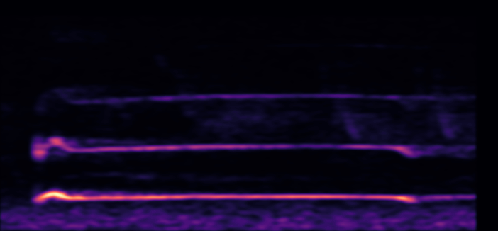 |
| 14 | INFERNO | 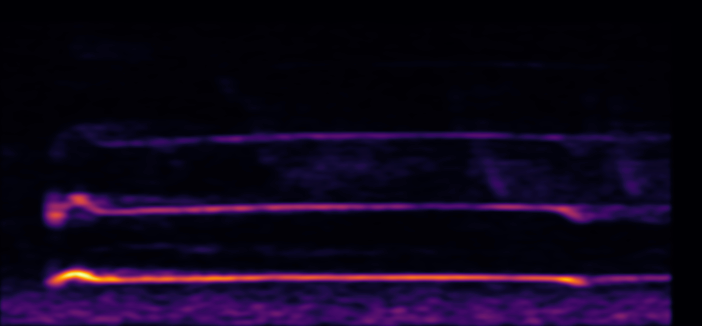 |
| 15 | PLASMA | 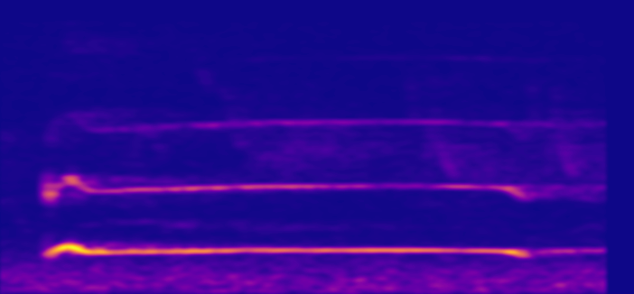 |
| 16 | VIRIDIS |  |
| 17 | CIVIDIS |  |
| 18 | TWILIGHT | 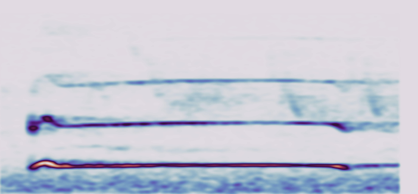 |
| 19 | TWILIGHT_SHIFTED |  |
| 20 | TURBO |  |
| 21 | DEEP_GREEN |  |